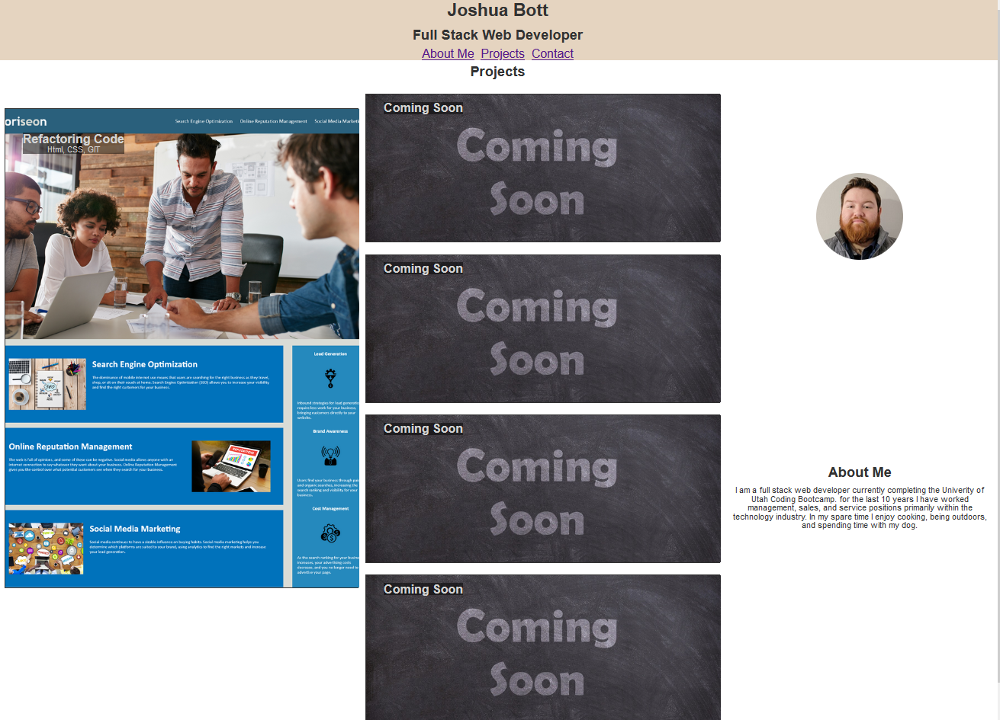

# Joshua-Web-Dev-Portfolio

## Description

This is a professional web developer profile page for Joshua Bott. This wepbage was made to provide potential employers an opportunity to see my skills and learn more about me.

## Installation

[DeployedWebpage](https://josh4got.github.io/Joshua-Portfolio/)

## Usage

To use this webpage you can view web developement projects I have completed. You can click on images of each project to see the full deployed project. You can also utilize links to navigate the webpage contact me directly.

## Credits

[Professional Readme Guide](https://coding-boot-camp.github.io/full-stack/github/professional-readme-guide)

[Organizing CSS](https://developer.mozilla.org/en-US/docs/Learn/CSS/Building_blocks/Organizing)

[Flexbox](https://www.w3schools.com/css/css3_flexbox.asp)

[Objectfit](https://www.w3schools.com/css/css3_object-fit.asp)

## License

Please see LICENSE in the repo.
